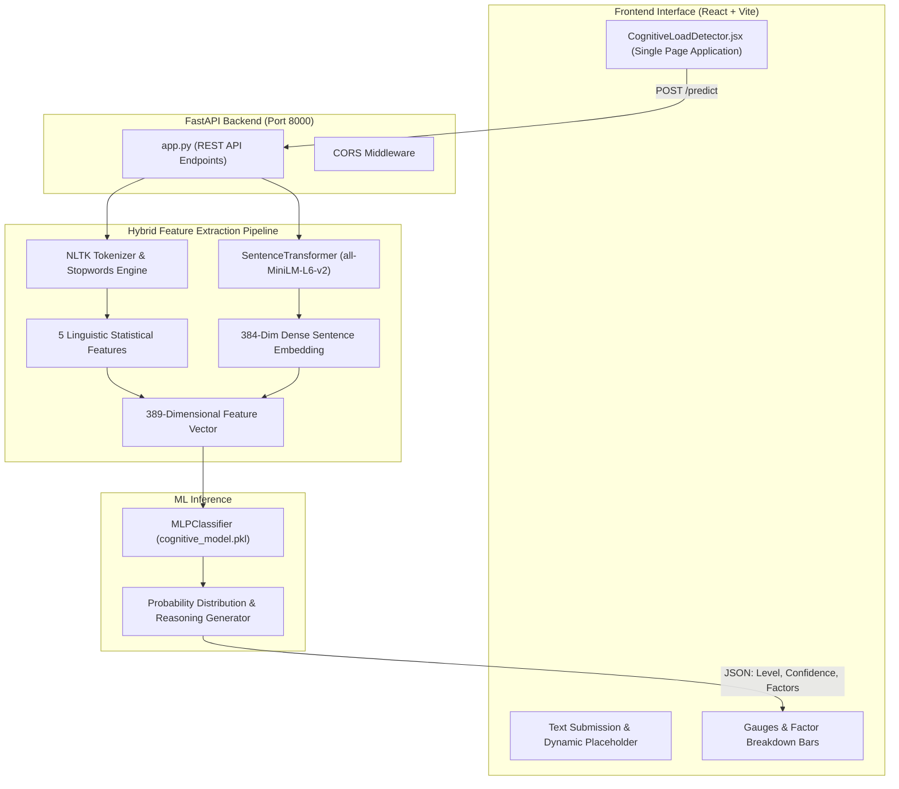

# Cognitive Load Detector & Text Analysis

A full-stack artificial intelligence application that quantifies the mental workload required to read and comprehend written text. The system combines transformer-based sentence representations with computational linguistic feature engineering, powered by a trained multilayer perceptron classifier and served via a decoupled FastAPI backend with an interactive React interface.


---

## Overview

Cognitive load theory posits that human working memory has a strictly limited capacity. Text with high lexical obscurity, intricate clause structures, or heavy information density imposes significant extraneous cognitive load on readers.

This platform automates cognitive load evaluation for any text—ranging from concise communications and technical manuals to peer-reviewed research abstracts. It produces an objective classification (**LOW**, **MEDIUM**, or **HIGH**), accompanies the score with confidence probabilities, and isolates four linguistic dimensions to explain *why* the text demands cognitive effort.

---

## Key Features

- **Hybrid NLP Pipeline**: Fuses 384-dimensional dense semantic representations from `sentence-transformers/all-MiniLM-L6-v2` with 5 targeted statistical linguistic features into a unified 389-dimensional feature space.
- **Explainable Multi-Dimensional Breakdown**:
  - **Lexical Complexity**: Evaluates vocabulary difficulty and average word length.
  - **Syntactic Complexity**: Analyzes sentence length and grammatical structural burden.
  - **Conceptual Load**: Quantifies the frequency of multisyllabic and technical vocabulary (words exceeding 6 characters).
  - **Information Density**: Measures the ratio of content-bearing lexical items versus grammatical stopwords.
- **FastAPI Inference Engine**: Sub-second REST API processing with preloaded weights and automated NLTK tokenizer caching.
- **Glassmorphic React Interface**: Interactive Single Page Application built with Tailwind CSS, animated typing prompts, real-time confidence gauges, and progress indicators for each linguistic dimension.

---

## Architecture



---

## Machine Learning Pipeline

### Feature Representation (389 Dimensions)

The classifier operates on a concatenated feature vector consisting of:

| Feature Group | Dimension Count | Description | Extraction Technique |
| :--- | :--- | :--- | :--- |
| **Word Count** | 1 | Total token volume | NLTK word tokenizer |
| **Unique Words** | 1 | Lexical diversity and vocabulary breadth | Unique token set count |
| **Average Word Length** | 1 | Mean character length per word | String length sum / token count |
| **Complex Word Count** | 1 | Frequency of words with $> 6$ characters | Conditional length filter |
| **Stopword Ratio** | 1 | Proportion of grammatical function words | NLTK English stopword lexicon |
| **Dense Sentence Embedding** | 384 | Semantic contextual representation | `all-MiniLM-L6-v2` transformer |

### Classification Architecture

- **Model Type**: Scikit-Learn `MLPClassifier` (Multi-Layer Perceptron)
- **Target Classes**:
  - `0`: **LOW** (Accessible, conversational, and direct)
  - `1`: **MEDIUM** (Standard journalistic or general explanatory content)
  - `2`: **HIGH** (Dense technical, academic, or syntactically convoluted writing)

---

## Project Structure

```
Cognitive_Load_Analysis/
├── backend/
│   ├── app.py                     # FastAPI server, feature extraction, and prediction endpoints
│   ├── cognitive_model.pkl        # Trained MLPClassifier model weights (1.88 MB)
│   └── requirements.txt           # Python backend dependencies
├── frontend/
│   ├── public/                    # Static web assets
│   ├── src/
│   │   ├── assets/                # Images and vector icons
│   │   ├── App.jsx                # Root component orchestrator
│   │   ├── App.css                # Component styling rules
│   │   ├── CognitiveLoadDetector.jsx # Full analysis dashboard with gauges and factors
│   │   ├── index.css              # Tailwind CSS directives and base styles
│   │   └── main.jsx               # Application DOM entry point
│   ├── index.html                 # HTML5 template
│   ├── package.json               # Frontend dependencies and Vite scripts
│   └── vite.config.js             # Vite build configuration
├── cognitive-load-detector.jsx    # Standalone portable component export
├── .gitignore                     # Git exclusions (venv, node_modules, cache)
├── LICENSE                        # MIT License
└── README.md                      # Comprehensive documentation
```

---

## Getting Started

### Prerequisites

- **Python**: Version 3.10 or higher
- **Node.js**: Version 18.0 or higher
- **npm** or **yarn**

---

### 1. Backend Setup (FastAPI & ML Engine)

1. Navigate to the `backend` directory:
   ```bash
   cd backend
   ```

2. Create and activate a virtual environment:
   ```bash
   # Windows (PowerShell)
   python -m venv venv
   .\venv\Scripts\Activate.ps1

   # macOS / Linux
   python3 -m venv venv
   source venv/bin/activate
   ```

3. Install required Python packages:
   ```bash
   pip install -r requirements.txt
   ```

4. Launch the FastAPI server:
   ```bash
   python -m uvicorn app:app --reload --port 8000
   ```

*(On initial startup, NLTK tokenizers and the 90 MB MiniLM transformer model will automatically download and cache).*

The backend API will be live at `http://localhost:8000`.

---

### 2. Frontend Setup (React + Vite)

1. Open a new terminal and navigate to the `frontend` directory:
   ```bash
   cd frontend
   ```

2. Install dependencies:
   ```bash
   npm install
   ```

3. Start the development server:
   ```bash
   npm run dev
   ```

4. Open `http://localhost:5173` in your browser.

---

## API Reference

### Health Check

```http
GET /
```

**Response**:
```json
{
  "status": "ok",
  "msg": "POST /predict with {text: '...'}"
}
```

### Predict Cognitive Load

```http
POST /predict
Content-Type: application/json
```

**Request Body**:
```json
{
  "text": "The implementation of multi-layered perceptron architectures facilitates nuanced evaluations of informational density across high-dimensional semantic vector spaces."
}
```

**Response**:
```json
{
  "level": "HIGH",
  "confidence": 94.2,
  "reasoning": "Model classified this as high cognitive load based on 19 words, 11 complex words, and an average word length of 8.2 characters.",
  "factors": {
    "lexical": 98,
    "syntactic": 10,
    "conceptual": 55,
    "information": 68
  }
}
```

---

## Author

**Dhruv Basia**
- GitHub: [@DhruvBasia](https://github.com/DhruvBasia)

---

## License

This project is licensed under the [MIT License](LICENSE).
